# ai4science on one machine — design

**Status: design, 2026-08-04. The agent loop is built and tested; the market and
the token economy are not.**

> **Copied to `AI4Science/docs/AI4SCIENCE_ONE_MACHINE_DESIGN.md`**, which is the
> design of record for ai4science — it sits beside the code it describes. This
> copy is kept because the sibling specs here reference it; if the two diverge,
> that one is right.

This page is about **ai4science alone**, on **one machine**. No manager, no
server, no app. Everything here works with nothing else installed, which is the
property the whole arrangement rests on: singularity requires ai4science, and
ai4science requires nothing.

Earlier specs mixed the two because the app was being designed at the same time.
This one does not mention singularity again except in §14, where the difference
in what a run costs is the only place it matters.

| Question | Document |
|---|---|
| What does one **session** do, node by node? | [`guide-sarsi-claude-overview.md`](../guide-sarsi-claude-overview.md) |
| What does the **app** add on top of this? | [`2026-08-04-sarsi-agent-market-and-pwm-design.md`](2026-08-04-sarsi-agent-market-and-pwm-design.md) |

### Where each of the fourteen points is answered

The requirement came as fourteen numbered points. The sections that answer one
say so in their own titles, so a point can be found by scrolling:

```
1. What ai4science is                           (Point 10)
4. The entry: the machine agent                 (Point 7)
9. How the workspaces talk to each other        (Points 9 and 14)
10. Both doors                                  (Point 8)
11. The market                                  (Points 1 and 2)
11a. The tools and sub-agents this system needs (Point 13)
11b. Research agents                            (Point 11)
     The governor's research agents             (Points 6 and 12)
13. What runs it costs                          (Points 2, 3 and 4)
     Your own key, run freely, and earn         (Point 5)
```

**Points 2 and 7 are answered here in their ai4science form only.** The app's
half of each — the 5% platform share, and the chatbot front door with its `+` —
is in [the market design](2026-08-04-sarsi-agent-market-and-pwm-design.md),
because this page is point 10 and does not describe the app. What is here is the
half a single machine has: no platform share is charged, and the front door is
the machine agent.

---

## 1. What ai4science is (Point 10)

A set of agents that live on your machine, hold tasks, plan them, and get them
done through governed `sarsi-claude` sessions — with a verifier that judges the
plan's own criteria and gates that stop anything reaching the world without you.

**What it does not have:** a manager, a server, a fleet, another machine. Those
belong to the app, and their absence is what makes this a complete product
rather than a client.

## 2. The invariant

> **The agent you talk to does not execute. Only a worker touches
> `sarsi-claude`.**

On one machine there is no network boundary to enforce this, so it is enforced
as a code path: the machine agent plans, routes and answers, and `assign` raises
if it tries to drive a session. Everything below assumes it.

Three rules carry the same weight:

> **Drafting is not sending.** An agent may compose anything. Every act that
> leaves the machine and reaches a person needs a grant naming *that act*.

> **The model is an engine, not an authority.** No permission, ceiling, verdict
> or grant derives from which model is running.

> **Share intent, not instruments.** A goal, a plan and a decision mean the same
> thing anywhere. A tool inventory, a path and a resource reading are about a
> host and stay on it.

## 3. Topology

```
  TWO SURFACES, ONE AGENT
  ┌──────────────────────────┐   ┌──────────────────────────────┐
  │ Telegram — one bot each  │   │ the ai4science CLI           │
  │ owner-locked             │   │ /agent <id> · ask non-interactively │
  └───────────┬──────────────┘   └───────────────┬──────────────┘
       │  bindings: {channel, accountId} → agentId              │
       ▼                                                        ▼
  the gateway            one local daemon; hosts every agent's loop
    │
    ├── machine agent    THE ENTRY CHAT · knows this machine · MAY NOT drive a session
    ├── sarsi-worker     the base worker — any task with no better home
    ├── work             the 9-to-5 job · reads mail, never sends
    ├── social           one daily read · drafts for the three destinations
    ├── funding          applications · an eligibility claim must cite a source
    ├── jobs             CV · application sites
    ├── abraham          personal · loosest scope, tightest authority
    └── …                anything installed from the market
          each: own workspace · tasks · sessions · playbook · self-model
          each holds SEVERAL TASKS ↓
                task ── plan0.md      phases · Verified when · Permissions needed
                  ▼
                sarsi-claude          ONE PER TASK · handed the PLAN, not the wish
                  ↓ guides
                Claude Code
    │
    └── vault            local · standing policy → per-use prompt · ALLOW / DENY
```

**One daemon, every agent's loop, both doors.** A rule cannot exist on one
surface and not the other, which is the only way *"two doors, one agent"*
survives a third door being added later.

## 4. The entry: the machine agent (Point 7)

Entering ai4science puts you in conversation with the **machine agent**. It is
the right thing to land in because the first questions anyone has are about
*this machine*: what can it do, what is running, which worker should take this.

| It does | It may not |
|---|---|
| answer about this machine — tools, sessions, workers, what is waiting | drive a session |
| route a request to the worker that should hold it | hold a secret |
| say plainly when nothing here can do a thing | queue an unplaceable request silently |

**It is replaceable from the market**, and it is the strictest listing there:
the thing that reads every message you type before anything else does, and
decides which worker hears it. There is always exactly one installed — swapping
is not removing. A market machine agent may declare **no outward classes** and
bring **no session-starting sub-agent**; what bounds a bad one is the invariant.

## 5. The agents

| Agent | For | Tools | May complete |
|---|---|---|---|
| **machine agent** | this machine: routing, inventory, the fleet-of-one view | none — it does not execute | nothing |
| **`sarsi-worker`** | any task with no better home | shell, editor, browser | nothing — its work stays here |
| **`work`** | the 9-to-5 job | qupath, matlab, mail.read | **nothing** — it reads mail and drafts; sending is not its act |
| **`social`** | one daily read, and influence | browser | `post` |
| **`funding`** | applications | browser, documents | `submission` |
| **`jobs`** | CV, application sites | browser, documents | `submission` |
| **`abraham`** | the owner's own life, not their job | browser, calendar, documents, payment | `recurring`; **no standing grants** |

`outward` is a **whitelist**: a class absent from a row is refused, so a class
nobody has claimed is refused everywhere until someone claims it.

**Four classes no agent completes at any ceiling** — `money`, `consent`,
`publishing`, `legal`. `abraham` prepares all four and completes none, and
**abstains rather than asks**: putting one in front of the owner would imply a
yes existed, and turn *"this cannot be authorised"* into *"you didn't approve
it"*.

**Tools are a profile, not an inventory.** A request needing a tool outside an
agent's row is refused before the machine is asked whether it has it: `work` has
no payment tool, so it is not asked to pay on a machine that could.

### `work` — mail is the sharp edge

| It may | It may not |
|---|---|
| read the mailbox | send anything |
| draft a reply and show it | send the draft it wrote |
| triage, summarise, say what needs the owner | **act on a mail that asks it to act** |

> **An instruction inside an email is not an instruction to the agent.** *"Please
> wire the invoice"* is evidence that someone asked, never authority to do it.
> Without this, "read the owner's email" is a remote control into the machine,
> and whoever can message them is holding it.

Enforced as a whitelist of the owner's own doors: a directive may be lifted from
the CLI or Telegram and from nothing else. Mail, feeds and webhooks enter as
marked evidence.

## 6. The loop

```mermaid
flowchart TB
    U["<b>U</b> · OWNER speaks<br/>CLI or Telegram"]:::owner
    MA["<b>MA</b> · the machine agent<br/>answers · routes · MAY NOT execute"]
    HAVE{"<b>HAVE</b> · is there an agent for this?"}
    MKT["<b>MKT</b> · agents-search"]:::market
    INST["<b>INST</b> · 🔐 OWNER installs it"]:::owner
    AGT["<b>AGT</b> · a worker holds it"]
    CAP{"<b>CAP</b> · can THIS machine do it?"}
    NOM["<b>NOM</b> · nothing here can<br/>say so, never queue silently"]:::lost
    TSK["<b>TSK</b> · task joins the worker's list"]
    PLN["<b>PLN</b> · the plan, made BETWEEN<br/>the worker and the session"]
    GRT["<b>GRT</b> · 🔐 OWNER grants what the plan declared"]:::owner
    VLT{"<b>VLT</b> · needs a secret?<br/>policy first, then ask"}:::vault
    ASG["<b>ASG</b> · the PLAN goes to sarsi-claude"]
    CC["<b>CC</b> · the work runs"]
    EVD["<b>EVD</b> · evidence accumulates<br/>on a timer, not on a screen"]
    VER{"<b>VER</b> · verified?<br/>the plan's own criteria"}
    ACT{"<b>ACT</b> · does it leave the machine?"}
    OWN["<b>OWN</b> · 🔐 OWNER grants THIS act"]:::owner
    REP["<b>REP</b> · typed report up"]
    SYNC["<b>SYNC</b> · W_name appended"]
    SA["<b>SA</b> · 🧠 self-model<br/>verified outcomes only"]:::sa
    ANS["<b>ANS</b> · the answer, on the door used"]:::owner

    U --> MA --> HAVE
    HAVE -->|"no"| MKT --> INST --> AGT
    HAVE -->|"yes"| AGT --> CAP
    CAP -->|"missing"| NOM --> ANS
    CAP -->|"present"| TSK --> PLN --> GRT --> VLT
    VLT -->|"DENY — name the secret"| REP
    VLT -->|"ALLOW · the secret never leaves"| ASG --> CC --> EVD --> VER
    VER -->|"FAIL"| CC
    VER -->|"PASS"| ACT
    ACT -->|"stays local"| REP
    ACT -->|"leaves"| OWN --> REP
    REP --> SYNC --> SA --> ANS

    classDef owner fill:#e8f0fe,stroke:#4c6ef5,color:#1a1a1a
    classDef lost fill:#fff3bf,stroke:#f08c00,color:#1a1a1a
    classDef market fill:#e6fcf5,stroke:#0ca678,color:#1a1a1a
    classDef vault fill:#ffe3e3,stroke:#c92a2a,color:#1a1a1a,stroke-width:2px
    classDef sa fill:#f3e8ff,stroke:#7c3aed,color:#1a1a1a,stroke-width:2px
```



**Blue is the owner, and there are four gates**: install, grant, vault, outward.
**`ASG` is the seam** — below it, the 27-node session loop runs unchanged.

**Three exits reach the owner and they are different things.** `GRT` is a plan
review: here is what this will need, before any of it runs. `OWN` is one act
asking to leave. `NOM` is a capability failure: nothing here can do this, and
here is what is missing.

## 7. Every node worth restating

### MA · the machine agent
**Fires:** anything typed, on either door. **Does:** answers about this machine,
or names the worker that should hold the request. **May not:** drive a session,
hold a secret, or claim a specialist's competence when routing — its expertise
is who is responsible for what, not how to do it.

### CAP · can this machine do it?
**Fires:** a request reaching a worker. **Reads:** the declared tool inventory
and the agent's own profile. **May not:** infer a tool from the text; a guess
refuses the wrong things confidently.

### PLN · the plan, made between the worker and the session
Not one drafting step. **The worker seeds it** from the owner's words and its
own history, into `plan0.draft.md`; **the session grounds it** against the actual
code; **the worker checks it back** against the rules the verifier depends on and
sends back exactly what is missing; **it is promoted** to `plan0.md` when it
passes, and not otherwise.

> **Why not either alone.** A plan drafted by one model in one shot has never
> seen the repository it describes. A plan the session writes alone is the
> session authoring the criteria it will be judged by.

The exchange goes through a **file, not a screen**, and an unchanged draft is not
agreement: if the session never touches it, the worker cannot tell "it agreed"
from "it died", so the round fails and the owner is asked.

### GRT · the owner grants what the plan declared
**Fires:** the plan's `Permissions Needed` section is non-empty. **May not:** be
inferred from the task having been asked for. A permission line the parser
cannot read declares **nothing** — so the task would walk past this gate to
`ready` while the plan the owner read still shows a permissions section. That
failure is silent and it fails open, so the writer and the reader are held to one
grammar: ``- `action` on `scope` - why``.

### VLT · the vault
Two stages: a standing policy the owner set in advance, or the owner asked now.
**A policy must name its counterparty** — `smtp` for `funding` is a blank cheque
— and **five per-use approvals never become a policy**, because a gate that
widens itself by being used is not a gate. An agent asks the vault to **use** a
credential and never receives one; there is no `read()`. Stored in the OS
keyring or under a passphrase-derived key, and **never in plaintext unless the
owner asked for that by name**.

### EVD · evidence
Captured on a timer and **accumulated**, not read off a screen when someone asks.
A verdict that depends on when it was asked is not a verdict: the same finished
work read PASS at one moment and FAIL an hour later, when the run had scrolled
away. The log only grows; the terminal is consulted for liveness only.

### VER · verified?
An independent judge, given the plan's criteria and the evidence. **Five
refusals**, each returning `UNVERIFIED` — which is neither pass nor fail:
no criteria, no evidence, a stale plan, no judge, and **an answer that gives both
verdicts**, which is not a judgement at all.

### OWN · the outward gate
The owner sees exactly what would go out. **The approved bytes are the
transmitted bytes** — anything edited after approval refuses. A timeout denies,
because silence is not consent. A refusal is an outcome and is recorded.

### SA · the self-model
Every line is an observation made when the question is asked. **Unmeasured is
`None`, never zero.** The limits line is always present. Nothing here writes a
ceiling, a grant or a playbook: reading cannot become authority.

## 8. Tasks and plans

A worker holds **several** tasks, concurrently, not a queue of one. Each owns a
`plan0.md` whose phases carry `Verified when:` lines — the sentences the verifier
will judge — and a `## Permissions Needed` section naming everything the work
needs beyond its own workspace.

| State | Means |
|---|---|
| `drafting` | no usable plan yet |
| `awaiting-grant` | the plan declares permissions the owner has not given |
| `ready` | plannable and permitted; not started |
| `waiting` | over the concurrency limit, **and it says so** |
| `running` · `done` · `failed` | as they read |

> **A task over the limit says so.** A task that is simply not started looks
> identical to a task nothing is working on, and the owner cannot tell which.

**An owner edit is authoritative and is never overwritten.** A polish round may
propose a successor beside it; the owner accepts or discards. And editing a
`Verified when:` line changes the standard the verifier applies — that is the
point, not a side effect.

### Asking for a task, and finding it again

Two things the owner does constantly, and they are different acts:

| | |
|---|---|
| **ask** | say what you want in a sentence; a task is created and planned |
| **recall** | ask what tasks exist; get them back **with a link each** |

**Recall is a read.** Listing tasks starts nothing, spends nothing and changes
nothing — it answers *what is going on*, which is a question the owner should
never have to pay for or think twice about asking.

**Every task has a stable address.** Not "the second one in the list": a name
that survives the listing being reprinted, that can be kept, pasted and come
back to tomorrow. Handles that are positions are wrong the moment anything
finishes, and a handle that means a different task than it did an hour ago is
worse than no handle.

**Following the link enters the task**, and entering a task means being in its
`sarsi-claude` session's context — its plan, its phases, its verdicts, its
evidence, and the modes that act on it.

> **A link identifies; it does not authorise.** Entering a task still requires
> being the owner. This matters more in the app, where a link is a URL and URLs
> travel — but it is a property of the address itself and not of the transport,
> so it holds here too: an address that granted access would make every list of
> tasks a list of keys.

**The machine agent can recall** — it is the front door, and *"what am I working
on"* is a question about this machine. So can any worker, about its own tasks.
Neither of them starts anything by answering.

### One worker, several tasks

A worker holds **several tasks at once**, concurrently, not a queue of one. Each
has its own plan, its own session, its own evidence and its own verdict, and
they do not share a context.

| | |
|---|---|
| **why concurrent** | a task waits on a model, a test run, a gate. A worker that could hold one would spend most of its life blocked |
| **the limit** | set per agent in its playbook, and a task over it is `waiting` **and says so** |
| **what is shared between them** | the worker's `W_name` and its history. Nothing else — two tasks are two sessions, two plans, two records |

> **A task over the limit says so, and that is the whole point of the state.** A
> task that is simply not started looks identical to a task nothing is working
> on, and the owner cannot tell which — so `waiting` carries the reason and the
> limit that caused it.

## 9. How the workspaces talk to each other (Points 9 and 14)

Every agent has its own workspace and its own history. They still need to share:
`funding` should know the deadline `work` found in a mail, and `jobs` should know
which CV `abraham` filed. The question is how, without dissolving the reason
there are seven of them.

### There is no channel between two agents

The first thing to say about how the workspaces talk is that they do not *talk*.
There is no message from `work` to `funding`, no inbox one agent can write into,
no socket between them. Communication happens **through a place**, and the place
is a file.

> **Why a place and not a pipe.** A pipe is a capability: once `work` can send to
> `funding`, it can send anything, at any moment, and `funding` processes it
> because it arrived. That is the shape of every prompt-injection route in this
> design — an untrusted mail becomes a message becomes an instruction. A place is
> read by an agent that decided to read it, at a moment it chose, while planning.
> Nothing arrives. Nothing interrupts. Nothing is processed because it was sent.

### The four tiers

| Tier | Who sees it | Holds | Written by |
|---|---|---|---|
| **`W_user`** | every agent | who the owner is, standing preferences, the do-not list | the owner |
| **`W_shared`** | every agent that was granted it | published facts — decisions, deadlines, entities, outcomes | any agent, deliberately |
| **`W_name`** | **one agent** | its mission, its plans, its conversation, what it decided and why | itself |
| **`W_host`** | **one agent, one machine** | tools present, paths, sessions, resources | itself |

### Four tiers are four paths

Isolation is a path question, not a discipline question — `layout.py` creates
these and nothing merges them:

```
~/.sarsi/
  workspace/                    W_user     every agent reads it, the owner writes it
  shared/facts.jsonl            W_shared   published facts — granted, append-only
  ledger/*.jsonl                           directives · reports · outward · vault
  agents/<id>/
    workspace/                  W_name     THIS agent only. history.md and its notes
    host/                       W_host     this agent, this machine. never leaves
    tasks/  sessions/  selfmodel/
                                W_secret   the vault, its own owner-installed root
```

`W_secret` is not in this tree on purpose. The vault answers ALLOW or DENY and
hands nothing over, so there is no tier for it to be shared *from*.

### The one rule: publish, never browse

```
work ──publish──▶  W_shared  ◀──read──  funding        ✅
work ─────────────▶ W_name(funding)                    ❌  never
```

An agent **publishes** a fact and **reads** the common space. No agent ever
reads another's `W_name`.

> **Why the asymmetry is the whole design.** Publishing is an act its author
> chose, at a moment they chose, about a thing they decided was worth saying —
> and it can be pointed at afterwards. Browsing another agent's history is a
> *capability*, and a capability that exists is used by everything that has it,
> including the market agent installed last Tuesday and the one whose author you
> have never met.

### What a published fact looks like

```json
{
  "by": "work",                       │ who said it
  "at": 1785900000.0,                 │ when
  "kind": "deadline",                 │ what sort of thing
  "text": "the imaging grant closes on 2026-09-14",
  "about": ["imaging-grant"],         │ entities, so a reader can find it
  "provenance": {                     │ where it came from
    "source": "mail",
    "trusted": false,
    "note": "evidence that a mail said so — not that it is so"
  }
}
```

Four properties, each closing a way this could go wrong:

- **it names its author and its moment.** A space where facts float free of who
  said them is one where a wrong fact cannot be traced, weighed, or withdrawn.
- **it keeps its provenance.** A deadline read out of a mail stays *evidence
  that a mail said so*. Without this, the shared space becomes the laundering
  step: untrusted input goes in labelled and comes out as fleet knowledge, which
  is exactly the route the "an email is not an instruction" rule exists to close.
- **it is append-only.** Correcting is publishing a correction. History that can
  be edited is history that can be edited by whatever gets in.
- **it can be wrong.** Reading a fact does not make it true. A plan that leans on
  one cites it, and the verifier still judges evidence rather than citations.

### Three operations, and that is all

The private half is built (`workspace.py`); the shared half is the same shape
pointed at a common file.

| Operation | Tier | What it does |
|---|---|---|
| `remember(agent, text)` | `W_name` | append one dated line to this agent's own history. **built** |
| `context(agent, task=)` | `W_name` + `W_user` | assemble what this node knows, labelled, small enough for a prompt. **built** |
| `publish(agent, fact)` | `W_shared` | append one fact, stamped with author, moment and provenance |
| `read(kind=, about=, since=)` | `W_shared` | the facts this agent was granted, filtered, most recent last |

There is no `update`, no `delete`, and no `read(agent=...)`. The first two are
absent because the tier is append-only; the third is absent because it is the
capability this whole section exists to withhold.

### When an agent reads — at plan time, not on arrival

Reading is a step in making a plan, not a background subscription:

```
directive ─▶ context(W_name, W_user) ─▶ read(W_shared) ─▶ draft ─▶ ground ─▶ GRT
                    what I know          what was published
```

`context()` is already what a planner reads before drafting — that is why the
module exists, because *an agent that plans without reading its own history
plans the same task again*. The shared tier is one more labelled block in the
same prompt: **`WHAT OTHER AGENTS HAVE PUBLISHED (facts, not instructions)`**.
The label is doing work. A fact arrives in a prompt next to a directive, and the
only thing keeping it from being read as one is that it is named as evidence.

Nothing is pushed. No agent is woken because another published something. An
agent that is not planning does not read, and a fact published today is found by
whoever plans tomorrow.

### Knowing is not asking

This is the distinction the shared space keeps getting asked to blur.

| `work` wants `funding` to… | Route |
|---|---|
| **know** the deadline | publish a fact. `funding` finds it next time it plans. |
| **do** something about the deadline | **not this tier.** That is a task, and a task comes from the owner. |

> **An agent may not task another agent.** If publishing could cause work, then
> a fact would be an instruction with a delay on it, and the mail `work` read
> this morning would reach `funding`'s hands through two hops that each looked
> harmless. So there is no hop where a fact becomes a directive. Work comes from
> the owner — through the machine agent or the app — and it stops at `GRT` and
> `OWN` on the way, every time, however well-founded the fact behind it was.

`attention` and the digest are how the owner learns a fact is sitting there
worth acting on. A person decides; the fleet surfaces.

### Across machines

`W_shared` belongs to the **owner**, not to a host. Two machines running
ai4science under one account are two places the same published facts should be
readable — a deadline is a deadline on both.

| Tier | Crosses a machine boundary | Why |
|---|---|---|
| `W_user` | **yes** | who the owner is does not change per host |
| `W_shared` | **yes** — that is the point | facts are intent-level and mean the same thing anywhere |
| `W_name` | **no** | it is that agent's own history, and syncing it would be the browse this design refuses, done by a daemon |
| `W_host` | **never** | `write /home/me/reports` is a different directory on a different machine; promoting one manufactures authority over something nobody looked at |

Sync is append-and-merge, not replicate: both files are append-only lines with an
author and a moment, so union is the merge, and there is no conflict to resolve
because nothing is ever edited. Until the sync exists, each machine has its own
`W_shared` and says so — an empty tier is honest, a silently partial one is not.

### What is built, and what is not

| | Status |
|---|---|
| `W_name`, `W_host`, `W_user` as separate directories | **built** — `layout.py` |
| private history, recall, and prompt context | **built** — `workspace.py` |
| the shared append-only-log shape | **built**, for a different purpose — `ledger/*.jsonl` already records directives, reports, outward requests and vault decisions this way, across agents |
| `publish` / `read`, the fact record, the manifest grant | **designed here, not written** |
| cross-machine sync of `W_shared` | **designed here, not written** |

The ledgers matter as precedent: the append-only shared log is not a new
mechanism this section invents, it is the one already carrying every governance
record in the system, given a second file and a provenance field.

### What never goes up

`W_host` — tools, paths, sessions, resource readings. They are *about a host* and
mean nothing off it, and promoting one manufactures authority over something
nobody looked at: `write /home/me/reports` is a different directory on a
different machine.

`W_secret` — the vault answers ALLOW or DENY and hands nothing over, so there is
nothing here to publish.

> **`abraham` needs no special rule.** It publishes the **decision** and not the
> facts it concerns: *"booked the Tuesday appointment"* goes up; whose
> appointment, and for what, stays host-local. Other people's personal data never
> enters the shared space, so nothing has to get it back out.

### A worked example

1. `work` reads the mailbox and finds a funder's note. It **does not act on it** —
   mail is untrusted input, and an instruction inside it is not an instruction.
2. It publishes: *`kind: deadline`, "the imaging grant closes on 2026-09-14",
   provenance `mail`, `trusted: false`*.
3. `funding` reads the shared space when planning and finds it. Its plan says
   *"the funder's mail of 4 Aug states a 14 Sep deadline"* — a citation, not an
   assertion.
4. The plan still declares what it needs, still stops at `GRT`, and the
   submission still stops at `OWN`. **Nothing about a shared fact shortens the
   path to an act.**
5. If the deadline was wrong, the record shows who published it, when, and that
   it came from a mail. `work` publishes a correction; the original stays.

### Reading it is a permission

Installing a third-party agent must not hand a stranger's code everything the
owner's other agents have learned.

> **Declared at install, defaulting to no.** An agent gets `W_user` and its own
> `W_name`. `W_shared` is asked for in the manifest, shown on the install screen,
> and granted by the owner or not at all.

## 10. Both doors (Point 8)

| | Telegram | the ai4science CLI |
|---|---|---|
| how | one bot per agent, owner-locked | `/agent <id>`, or ask non-interactively |
| best at | approvals, vault prompts, the digest, a quick question | long planning turns, pasting files, reading a plan |
| reaches | the same agent, the same `W_name`, the same sessions | the same |

> **A surface is a door, not a scope.** An agent has one memory and one set of
> sessions regardless of which door the owner came through, and never re-asks
> something answered on the other one.

A **bot token is a vault secret**, not a config value: an agent that held its own
token could be moved, and then spoken to somewhere the owner is not looking.

## 11. The market (Points 1 and 2)

Three kinds of listing — **agents**, **tools**, **sub-agents** — each uploadable,
accepted by the governor, and installable. This is where they live, because an
agent is a thing you install on your own machine and run with your own keys; a
market that lived anywhere else would make using an agent require something else.

Acceptance asks a different question of each: an agent, *what may it do*; a tool,
*what does it touch* — it is closer to the hardware than any agent; a sub-agent,
*does it obey the ceiling and report honestly*. A verifier is the sharpest to
accept, because a lenient one inflates the record of every agent it judges.

**An accepted listing earns.** Uploading is not charity: an author whose agent,
tool or sub-agent is accepted is rewarded in PWM, and thereafter takes their
chosen fraction of the 5% slice on every run that uses it (§13). This is the
same for all three kinds — a tool or a sub-agent that everyone's agents plug into
is worth as much as an agent, and paying only for agents would starve the sockets.

**Trust is not transitive.** An agent may bring its own tools — one author, one
review — or require ones from the market, and then the install screen names every
author whose code comes with it and what each part may touch.

## 11a. The tools and sub-agents this system needs (Point 13)

A **tool** is something a task needs *present* to run — checked at `CAP`,
declared per agent as a profile, and refused by name when absent. A **sub-agent**
is something that does the work or judges it, plugging into a socket the runtime
provides.

### Sub-agents

| Sub-agent | Socket | Status |
|---|---|---|
| **`sarsi-claude`** | the session backend — start · send · interrupt · stop · ceiling · has · capture | **built.** The reference implementation, and the shape every other sub-agent matches |
| **the planner** | drafts the seed plan the session then grounds | **built** |
| **the verifier** | given criteria and evidence, answers PASS/FAIL or refuses | **built.** A domain verifier is a market listing |
| **a domain runner** | reconstruction, docking, simulation — work that is not code editing | market |

### Tools the seven need

| Tool | Who | What it touches |
|---|---|---|
| `shell` | `sarsi-worker` | the machine, as the owner |
| `editor` | `sarsi-worker` | files in the task's reach |
| `browser` | `sarsi-worker`, `social`, `funding`, `jobs`, `abraham` | the network, and pages that can lie to it |
| `mail.read` | `work` | the mailbox — **read only; there is no `mail.send`** |
| `documents` | `funding`, `jobs`, `abraham` | office files and PDFs |
| `calendar` | `abraham` | other people's whereabouts — `W_host`, never shared |
| `payment` | `abraham` | **prepare only.** `money` is reserved and no agent completes it |
| `qupath`, `matlab` | `work` | instrument data and licensed desktop software |

### Tools this design has assumed and not named

| Tool | Why it is needed | The review question |
|---|---|---|
| **GUI control** | `qupath` and `matlab` are desktop applications. A tool that "has MATLAB" and cannot drive its window can run a script and nothing else. `jobs` filling an application site hits the same wall the moment a page is not automatable. | it can click anything on the screen, including windows that are not the task's |
| **file transfer** | getting a result off the machine is an outward act and must go through `OWN`; getting an input *onto* it is not, and has no tool | where a file came from, and whether an agent chose it |
| **secrets rotation** | the vault stores; nothing rotates | it holds every credential at once |
| **notification** | the digest and `attention` have no way to reach an owner who is not looking | it can interrupt a person |

### Figma and TeamViewer

Both were suggested, and they are different kinds of thing.

**Figma — a design tool, and a reasonable market listing.** `social` drafting a
post image, or a design agent producing a mockup, is ordinary work with an
ordinary outward gate: the file is composed locally and publishing it stops at
`OWN`. It touches a network service and the owner's design account, so its
credential is a vault secret like any other. There is no new authority here, and
this repository already carries figma prototypes made exactly this way.

**TeamViewer — remote desktop, and the most dangerous tool in this document.**
It is worth being precise about which of two things is meant, because they are
opposite:

| Reading | What it is | Verdict |
|---|---|---|
| **the agent drives the desktop** — GUI control by another name | the same capability as the GUI-control row above, over a heavier protocol | **acceptable, as a tool with that review**: it can click anything, so it is declared, profiled, and gated like any other reach |
| **a remote party controls the machine** | an inbound channel that bypasses every gate on this page | **refuse.** |

> **The second reading inverts the whole design.** Every rule here says that the
> thing which acts is local, bounded by a ceiling, and answerable to an owner who
> can see it. A remote-control channel is an actor with no ceiling, no plan, no
> verdict and no record — and it would not be *breaking* the gates, it would be
> *going around* them, which is worse because nothing would report it.

> **If remote help is genuinely wanted**, the shape that fits this design is the
> one `interact` already uses: the owner attaches to a terminal they own, and
> the session keeps running under the same hook. A human who needs to see what
> is happening is a human at a door, not a second driver — the wheel exists
> because two of those is one too many.

## 11b. Research agents (Point 11)

A **research agent** — computational imaging, cancer, drug design — has two
functions. The first is ordinary: it holds tasks and works them through
`sarsi-claude` like any agent. The second is **autonomous research**, driven by
its own self-model: it works on owner-set tasks, on benchmarks, or on the
charter it shipped with, without being asked each time.

**It is off by default**, because it spends money on its own. Turning it on is a
standing, revocable permission with a budget; reaching the budget stops the loop
rather than asking for more. An agent may not turn it on or extend it.

> **Every gate still applies.** A research run produces a plan with
> `Verified when:` lines, stops at the grant for anything the plan declares,
> stops at the outward gate before anything leaves, and is judged by the same
> independent verifier. What the owner gave up is being asked each time; what
> they kept is every gate.

> **Self-directed work is recorded apart from the owner's.** An agent that wrote
> its own benchmark, passed it, and counted the pass toward its record would have
> published its own reputation — so owner-set tasks, benchmarks and self-directed
> research are three lines and never one number.

### The governor's research agents (Points 6 and 12)

Some ship from the governor rather than from a user. These are the seed of the
market, written where the domain knowledge is:

| Agent | Domain |
|---|---|
| **low-dose CT** | reconstruction at doses below what a classical pipeline can use |
| **computational imaging** | the broader inverse-problem family — snapshot compressive imaging, coded aperture |
| **medical physics** | treatment planning and QA, in the practice of Steve Jiang's group at UTSW |
| **pill-camera** | capsule endoscopy — reading video no clinician has time to read whole |
| **drug design** | docking, screening, and the loop from candidate to assay |

> **They are agents, not exceptions.** Governor-authored means reviewed by the
> same acceptance, installed by the same screen, bounded by the same ceiling, and
> judged by the same verifier. The one thing being the governor's buys is being
> written at all.

**They are also where the token flows.** These agents are heavy users of an LLM,
and they run against the exchange node — so their consumption is what pays the
PWM that reaches the people supplying it. A user who runs the exchange node earns
from work like this being done, which is why the seed agents are compute-hungry
research rather than something cheap.

## 12. Self-awareness and RSI

Every agent carries a self-model, and the contract is four refusals: every line
observed, unmeasured reported as unmeasured, the limits line always present, and
**no path from reading to authority**.

RSI is **propose → the owner signs → adopt**. A candidate must cite the
measurement that justifies it, or it is a preference with a version number
attached. When no metric supports a change, an honest no-change candidate is the
correct output. An agent cannot sign its own candidate, cannot raise its own
ceiling, and cannot promote a vault policy from per-use to standing — **a high
ceiling is permission to act, never permission to become more permitted.**

## 13. What runs it costs (Points 2, 3 and 4)

Every run has a **metered cost**: the provider's reported usage, priced at the
provider's rate. Not an estimate, and not a number the agent reports about
itself.

| Share | Goes to |
|---|---|
| **10%** | the PWM treasury pool |
| **0–5%** | the agent's author, at the fraction of the slice they chose |
| the rest | the LLM provider |

**A run on ai4science pays no platform share.** That is the difference this
product is: the app adds a manager and a front door and charges for them, and
none of that is needed here.

**Bring your own key.** A user may use their own API key or subscription; the
10% still applies, computed at the PWM/token ratio. Everyone starts with a small
**non-exchangeable** balance to pay it — spendable on fees, never sellable, and
visibly distinct so it cannot leak into the exchangeable supply. When it runs
short, an **exchange node** starts: visible, bounded by a budget the owner sets,
and **never touching the owner's tasks** — it is not a worker, holds no task
list, and may not drive a session. With enough PWM the owner may stop it.

### Your own key, run freely, and earn (Point 5)

Put together, the point of the last two paragraphs is one thing a user cares
about:

| | |
|---|---|
| **you may run on your own key or subscription** | ai4science does not resell you an LLM |
| **the only charge is the 10% fee** | computed at the PWM/token ratio, paid in PWM, not in your provider's currency |
| **the fee need never block you** | the bootstrap balance covers the start; the exchange node covers it after |
| **and the node earns** | supplying capacity to other people's runs is what pays it, so a machine that is already on can more than cover its own fees |
| **and you may stop it** | with enough PWM, the node is turned off and stays off |

So a user with their own key runs ai4science continuously without a bill from
us, and a user who leaves the node on is on the earning side of the same ledger.
Neither is a discount granted by anyone — it is what the 10% fee and the node
add up to.

> **Money buys nothing that matters.** Not a ceiling, not a gate, not a verdict,
> not a position in agents-search. A paid run that failed, failed.

## 14. What this does not do

- **No second machine.** No placement decision, no cross-host fold, no
  contradiction to resolve. Those are deleted rather than stubbed, because a stub
  that always answers the same way reads as a working mechanism.
- **No manager.** Routing across agents beyond this machine is the app's job.
- **No agent starts work on its own.** `start` is the owner's opt-in, and it is
  the only thing separating *"I asked a question"* from *"I authorised work"*.
- **No auto-approval of gates**, at any ceiling, for any agent, ever.

## 15. What it owes

1. **Telegram has never carried a message.** The code exists; *"one agent, two
   doors"* is proven in tests only.
2. **The vault has never carried live traffic.** No real credential has been
   asked for through it.
3. **The outward gate has never held a real act.**
4. **Evidence can only keep what it was shown.** Output that scrolled past the
   terminal's history before the first capture is gone.
5. **One agent's loop must not take the daemon down.** One process now hosts
   every agent, which trades an address space for a discipline, and nothing
   checks that a raise in one agent's turn is contained.
6. **Nothing in §11 or §13 is built.** The loop underneath them is.
